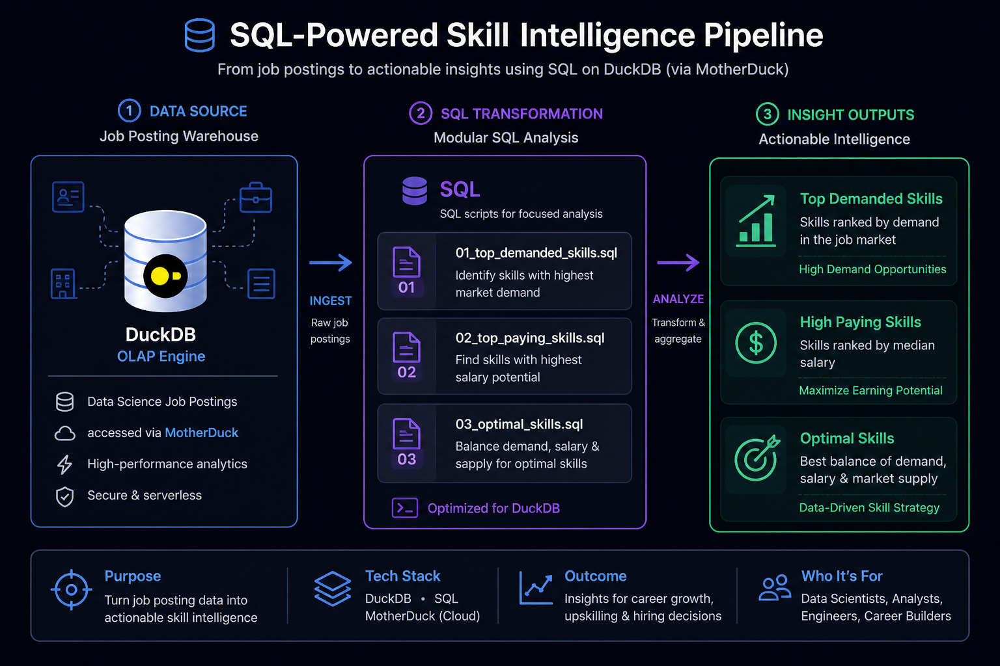
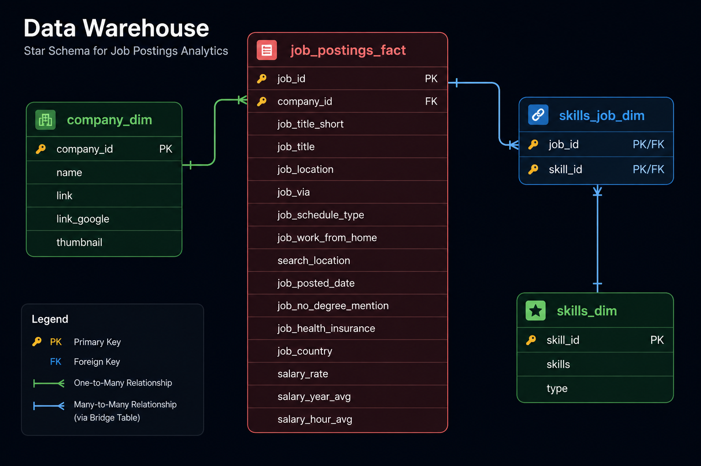

## 🔍 Exploratory Data Analysis with SQL: Job Market Analytics



A SQL-first analytics project exploring the data engineering job market using real-world job posting data. **This project demonstrates how I use SQL to move beyond simple querying—designing analytical workflows, joining dimensional models, and translating labor market data into business-ready insights**.

The goal was simple: **identify which skills are most in demand, which pay the most, and which offer the strongest long-term career ROI for data engineers**.

---

## 🧾 Executive Summary (For Hiring Managers)

This project was built to answer three practical market questions using production-style SQL and dimensional modeling.

* ✅ **Built 3 analytical SQL workflows** to evaluate demand, salary, and skill ROI in the data engineering market
* ✅ **Queried across a star schema** using fact, dimension, and bridge tables to model job-skill relationships
* ✅ **Applied analytical SQL techniques** including joins, aggregations, filtering, ranking, and score modeling
* ✅ **Generated actionable insights** on skill demand, compensation, and market value for data engineers

If you're reviewing quickly, these are the three core deliverables:

1. [`01_top_demanded_skills.sql`](./01_top_demanded_skills.sql) → identifies the most in-demand data engineering skills
2. [`02_top_paying_skills.sql`](./02_top_paying_skills.sql) → evaluates highest-paying skills by median salary
3. [`03_optimal_skills.sql`](./03_optimal_skills.sql) → ranks the best skills by balancing salary and market demand

---

## 🧩 Problem Statement

The data engineering market is crowded with tools, platforms, and programming languages—but not all skills carry the same market value.

This project was designed to answer three high-signal questions:

* 🎯 **Demand:** Which skills appear most often in data engineering job postings?
* 💰 **Compensation:** Which skills command the highest salaries?
* ⚖️ **Opportunity:** Which skills offer the strongest balance of demand and earning potential?

Rather than relying on intuition or anecdotal market advice, this analysis uses SQL to evaluate real job posting data and quantify which technical skills create the strongest career leverage.

---

## 🏗 Data Model & Warehouse Design

The analysis is built on a dimensional warehouse modeled using a star schema.



This schema enables efficient analytical queries across job postings, employers, and required skills.

### Core Tables

* **`job_postings_fact`**
  Central fact table containing job posting records, including title, salary, location, posting date, and remote eligibility.

* **`company_dim`**
  Company-level metadata used to enrich job postings with employer information.

* **`skills_dim`**
  Master skill catalog containing normalized skill names and classifications.

* **`skills_job_dim`**
  Bridge table resolving the many-to-many relationship between job postings and required skills.

This structure supports scalable analytical querying and mirrors the type of warehouse design commonly used in production BI and analytics systems.

---

## 🧰 Tech Stack

| Layer           | Tool               | Purpose                                         |
| --------------- | ------------------ | ----------------------------------------------- |
| Query Engine    | DuckDB             | OLAP-style analytical SQL engine                |
| Cloud Access    | MotherDuck         | Managed cloud access for DuckDB                 |
| Language        | SQL                | Analytical querying and insight generation      |
| Development     | Visual Studio Code | SQL development and workflow                    |
| Version Control | GitHub             | Versioned SQL scripts and project documentation |

---

## 📂 Repository Structure

```text
1_EDA/
├── 01_top_demanded_skills.sql    # Demand analysis
├── 02_top_paying_skills.sql      # Salary analysis
├── 03_optimal_skills.sql         # Demand + salary opportunity model
└── README.md                     # Project documentation
```

---

## 🔎 Analysis Overview

This project is structured around three focused SQL analyses, each designed to answer a specific market question.

### 1. [Top Demanded Skills](./01_top_demanded_skills.sql)

Identifies the most frequently requested skills in remote data engineering job postings.

This query answers:

* What tools show up most often?
* Which foundational skills are non-negotiable?
* What does the baseline modern data stack look like?

### 2. [Top Paying Skills](./02_top_paying_skills.sql)

Ranks skills by median salary to identify which technical capabilities command the strongest compensation.

This query answers:

* Which skills earn the highest salaries?
* Which niche skills carry salary premiums?
* Where does specialization create compensation upside?

### 3. [Optimal Skills](./03_optimal_skills.sql)

Combines salary and demand into a single weighted opportunity model to identify the most strategically valuable skills.

This query answers:

* Which skills maximize both employability and compensation?
* Which tools offer the best market ROI?
* What should data engineers prioritize learning next?

---

## 📈 Key Insights

### 1. SQL and Python dominate the market

SQL and Python are the most consistently requested skills across data engineering roles, reinforcing their position as foundational requirements.

These are not optional tools—they are baseline expectations.

### 2. Cloud is no longer a differentiator

Cloud platforms like AWS and Azure appear frequently across job postings, indicating that cloud fluency is now expected in modern data roles rather than treated as a premium specialization.

### 3. Infrastructure skills drive salary premiums

Skills tied to infrastructure and orchestration—such as Kubernetes, Terraform, and Airflow—consistently correlate with higher compensation.

This suggests the market increasingly rewards data engineers who can operate close to platform and production systems.

### 4. High salary and high demand rarely overlap

The highest-paying skills are often niche and lower in volume, while the most common skills tend to offer broader employability.

This creates a useful distinction between:

* **premium specialization** (higher pay, fewer roles)
* **market resilience** (more roles, broader demand)

### 5. The strongest career ROI sits in the middle

The most valuable skills are not always the highest-paying or most common—they are the ones that balance both.

This is where the strongest long-term career leverage exists.

---

## 💻 SQL Skills Demonstrated

This project was designed to showcase practical SQL skills used in real analytics and data engineering workflows.

### Query Design

* Multi-table joins across fact, bridge, and dimension tables
* Structured filtering with business-driven constraints
* Aggregations for demand and salary analysis
* Ordered ranking for top-N insight generation

### Analytical SQL

* `COUNT()` for demand measurement
* `MEDIAN()` for salary benchmarking
* `ROUND()` for cleaner business presentation
* `GROUP BY` for categorical aggregation
* `HAVING` for post-aggregation filtering

### Data Modeling & Logic

* Many-to-many relationship handling through bridge joins
* Dimensional modeling with fact and dimension tables
* Derived scoring logic for opportunity ranking
* Natural log normalization using `LN()` to reduce demand skew

### Data Quality & Practical Constraints

* Filtering null salary records for reliable compensation analysis
* Restricting to relevant job families (`Data Engineer`)
* Isolating remote roles for cleaner market comparisons
* Applying posting thresholds to remove low-signal outliers

---

## 🎯 Why This Project Matters

This project is less about writing SQL queries and more about demonstrating how SQL can be used to solve business problems.

It shows how I approach:

* translating ambiguous questions into measurable logic
* designing efficient analytical workflows
* extracting signal from messy relational data
* turning raw data into decision-ready insights

In practice, this is the kind of SQL work that sits at the center of analytics engineering, business intelligence, and data platform roles.
